# Setup AKS Cluster & Deploy Springboot Docker Container to AKS Cluster using Helm and Azure Pipeline

First I have created simple Spring Boot Java project in Intellij

Compiled using Maven and jar got generated in target folder

Running the app locally before pushing to AKS

Application running and getting  the result. Port is exposed to 8080

Next step. Will use Azure CLI to connect to Azure portal

 az login
 
 

 Selected my subscription 

 Next step is to create AKS cluster to deploy Java App. I have created script to handle that
 

It started creating resources defined in script file

All resources are created

Cluster is running

creating helm chart using create helm chart command  helm create my-aks-chart

Helm chart is created with all yaml templates

Create pipeline and choose classic editor

Choose Helm chart

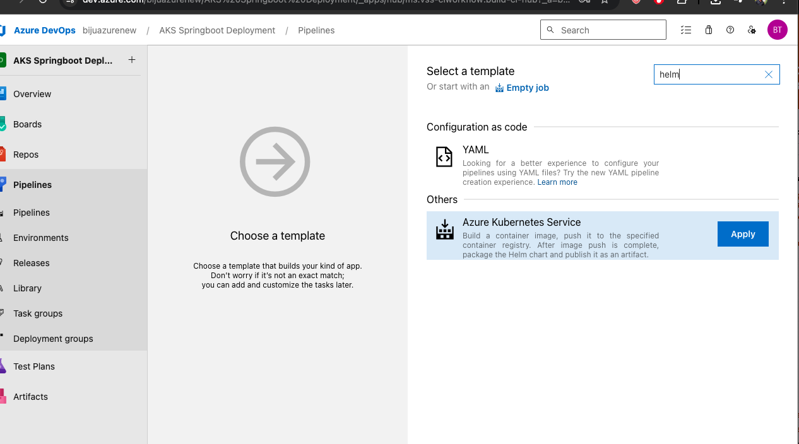

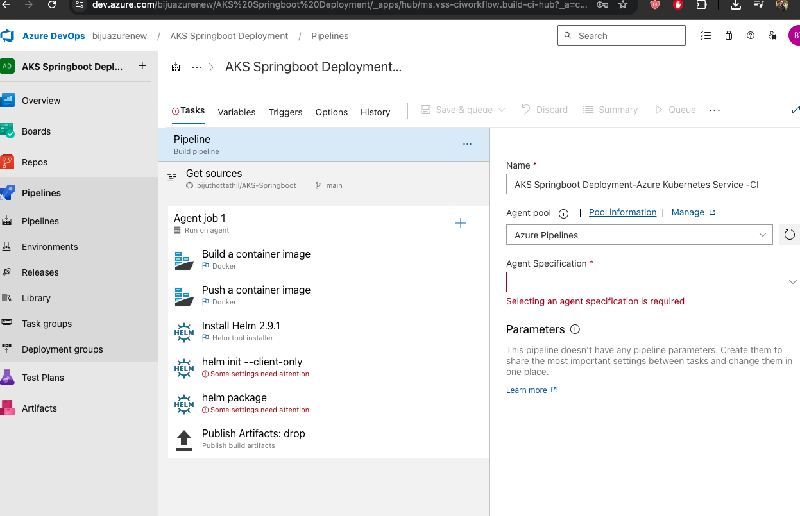

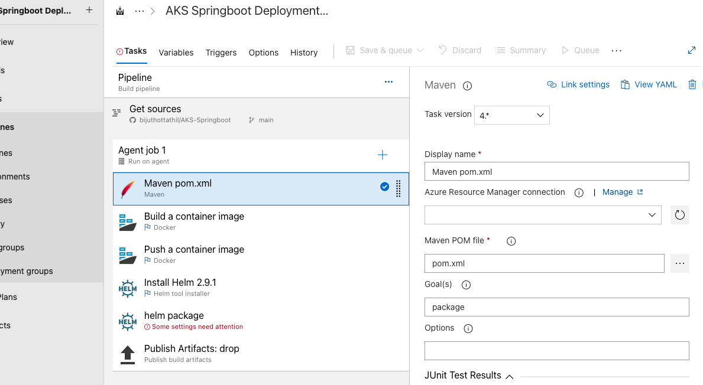

Select pom.xml for maven build

Goals  - Clean Install

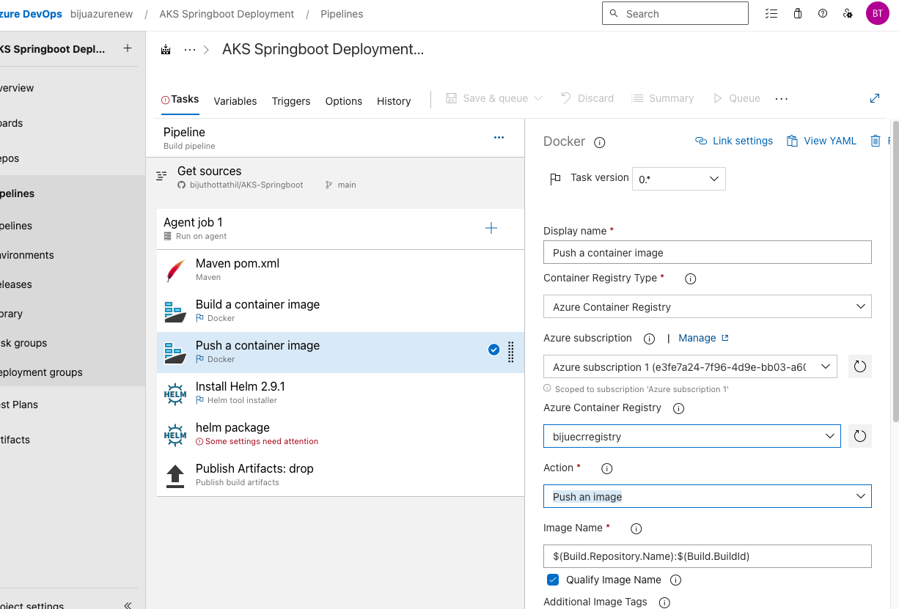

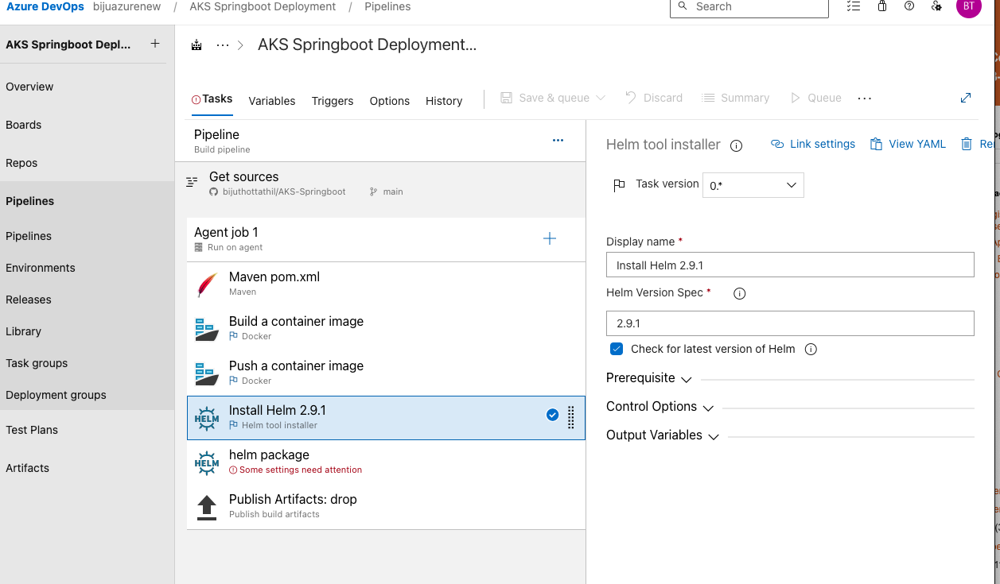

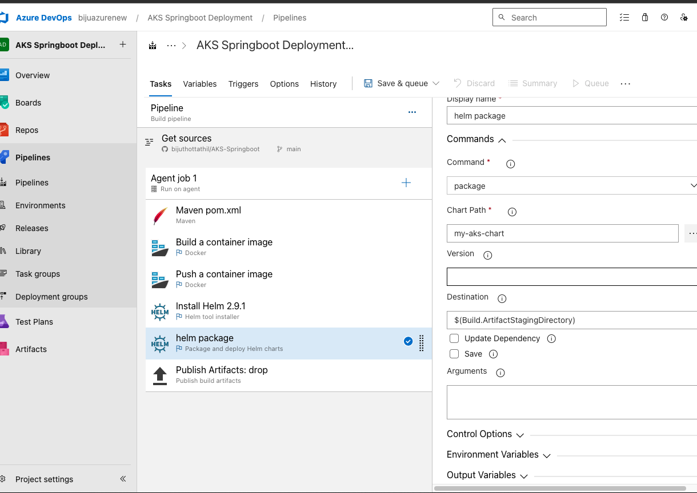

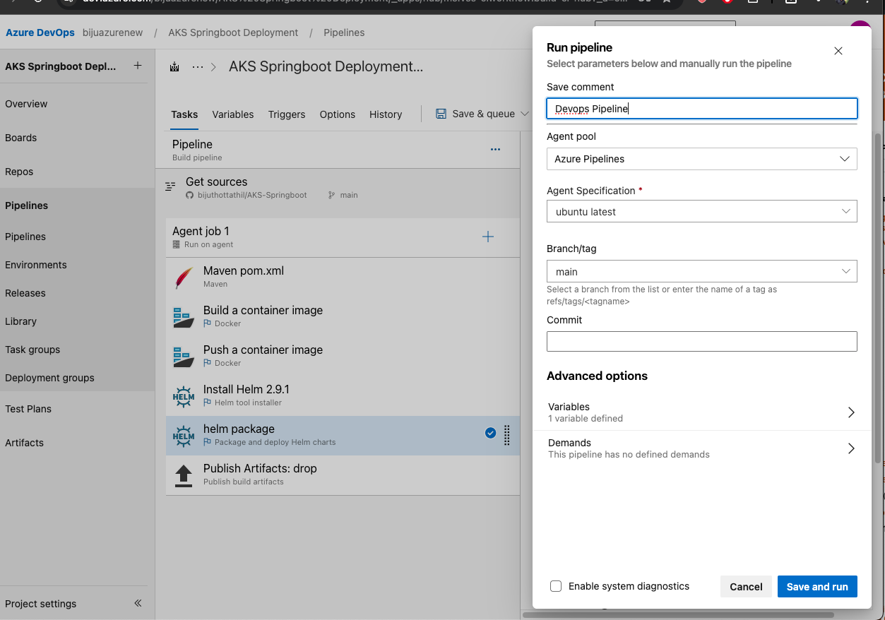

# Waiting for Microsoft Approval to get free parallel host to run pipeline

Next step is to create Release Pipe Line

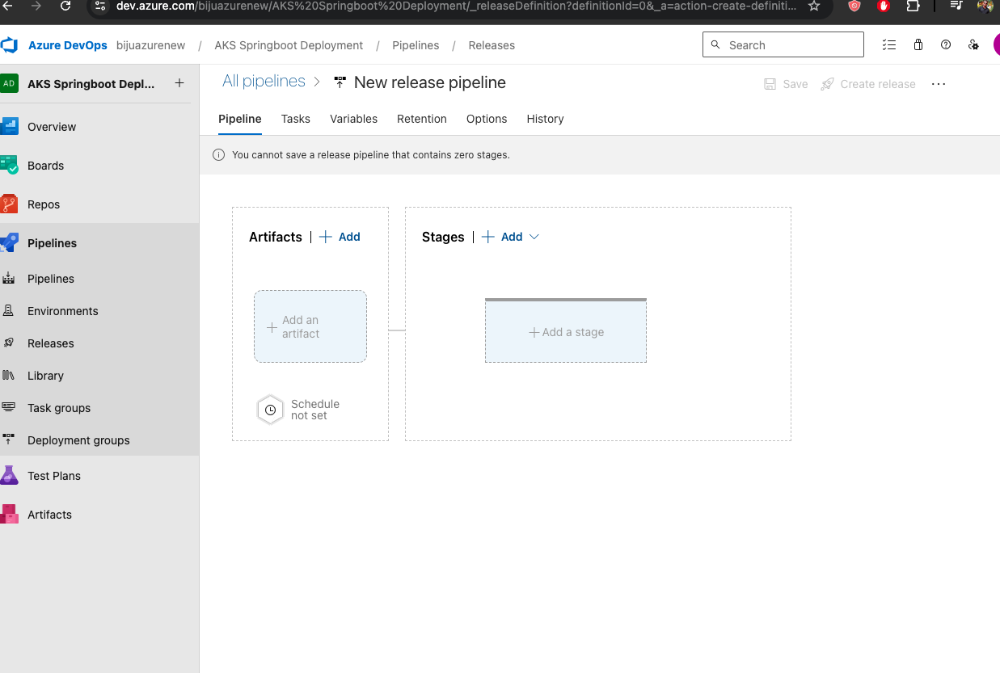

Search for Helm 
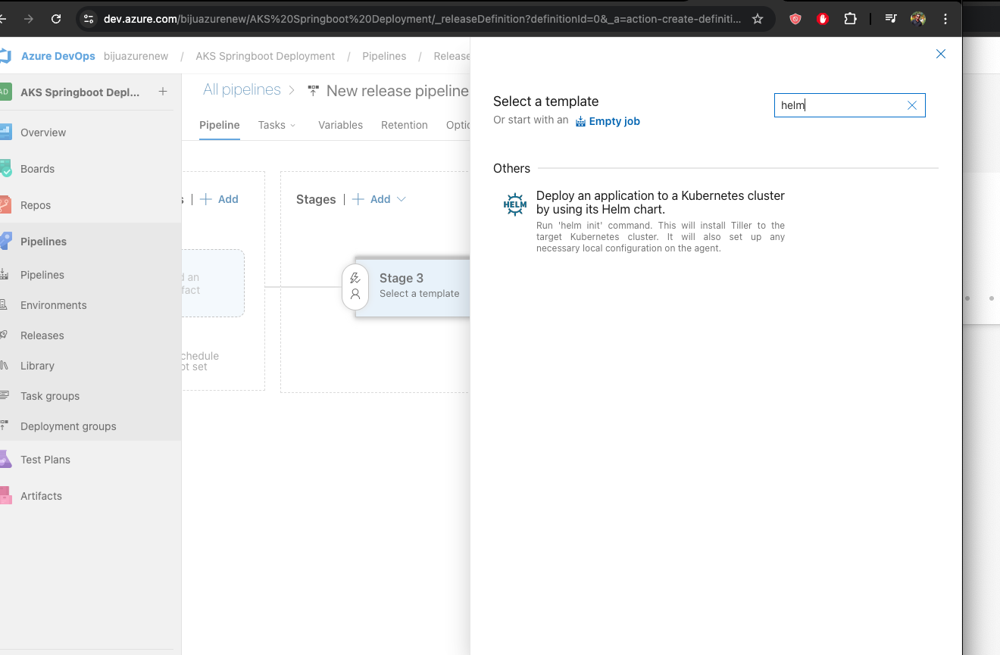

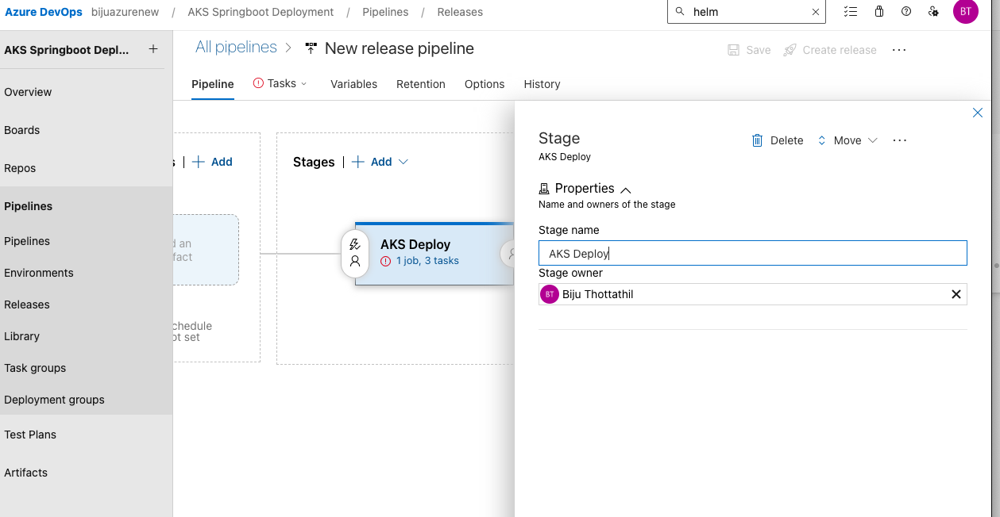

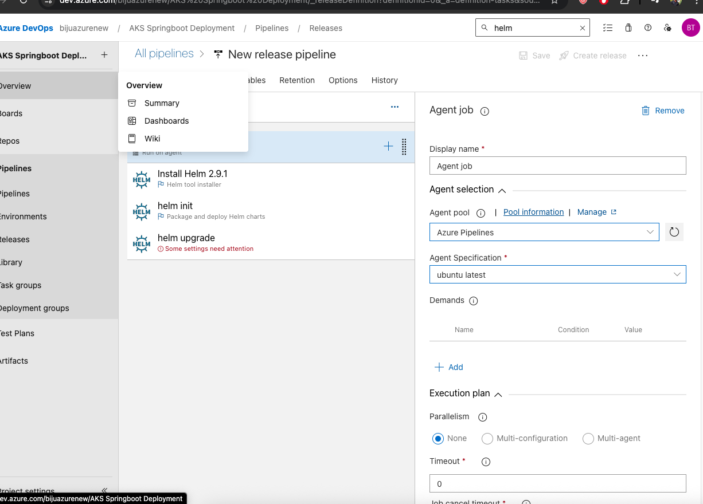

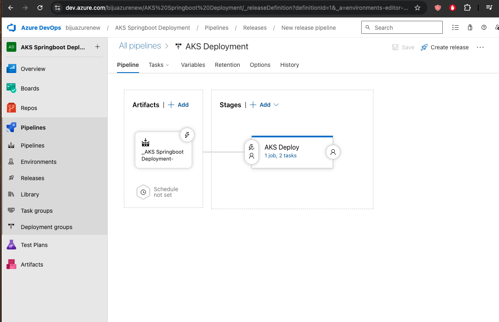
